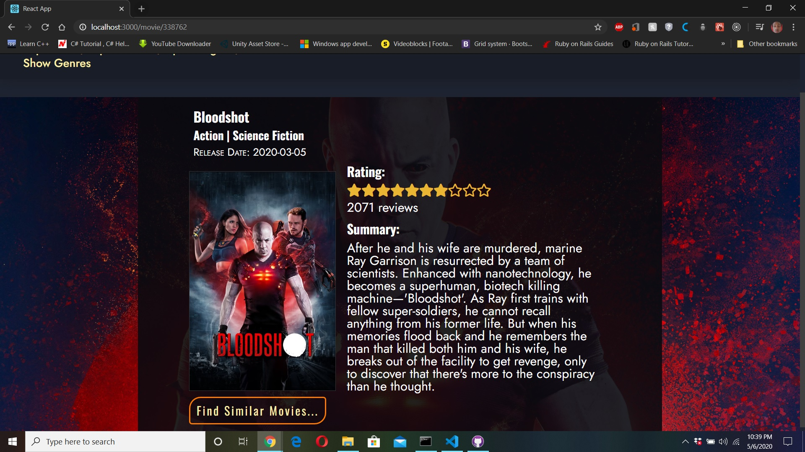

# REACT-REDUX-TMDB-MovieDB
[](https://app.netlify.com/sites/arn-tmdb-movies/deploys)

Microverse Capstone project

Web based Application using TMDB API to gather and manipulate information on various movies.




## [Live Link](https://arn-tmdb-moviedb.herokuapp.com)

## Built With

- HTML, CSS
- JavaScript
- React.js
- React-Router
- Redux.js
- Redux-Thunk
- NPM Webpack

### Tested Compatibility with the latest versions of 
- Firefox(Version: 76.0.1 (64-bit)), 
- Chrome(Version: 81.0.4044.138 (Official Build) (64-bit)), 
- Opera(Version: 68.0.3618.63) and 
- Microsoft Edge(Version: 44.18362.449.0)

as of 5/11/2020

## Setup for Local use

### Clone Repository

Grab a clone of [this repository](https://github.com/Aaron-RN/REACT-REDUX-TMDB-MovieDB/tree/v1.0) from Github

### Obtain API Key

In order for this application to work you will have to obtain an API key from TMDB and either produce your own .env file or simply swap out the code in the redux/actions/index.js

1. Go to [TMDB](https://www.themoviedb.org/documentation/api) sign up and follow the provided instructions to request for an API Key
2. After you have obtained your API key you will go into the redux/actions/ folder and open the index.js file there
3. On line 6 where you would see const ```API_KEY = process.env.REACT_APP_API_KEY;```, replace ```process.env.REACT_APP_API_KEY``` with the key that you obtained from [TMDB](https://www.themoviedb.org/documentation/api)
4. (Optional) Instead of replacing the code on line 6 you could create a .env.local file within the project's root directory and then within this file you would define your API key under the same name as so: ```REACT_APP_API_KEY="<ENTER YOUR API KEY HERE>"```

### Install Dependencies

```
$ npm install
```

### Run Application

```
$ npm run server
```

### Running Tests

```
$ npm run test
```

### Future Features

- Ability to seach for movies by title

## Author

👤 **Aaron Rory**

- GitHub: [@Aaron-RN](https://github.com/Aaron-RN)
- Twitter: [@ARNewbold](https://twitter.com/ARNewbold)
- Linkedin: [Aaron Newbold](https://www.linkedin.com/in/aaron-newbold-1b9233187/)

## 🤝 Contributing

Contributions, issues and feature requests are welcome!

Feel free to check the [issues page](issues/).

## Show your support

Give a ⭐️ if you like this project!

## 📝 License

This project is [MIT](lic.url) licensed.
